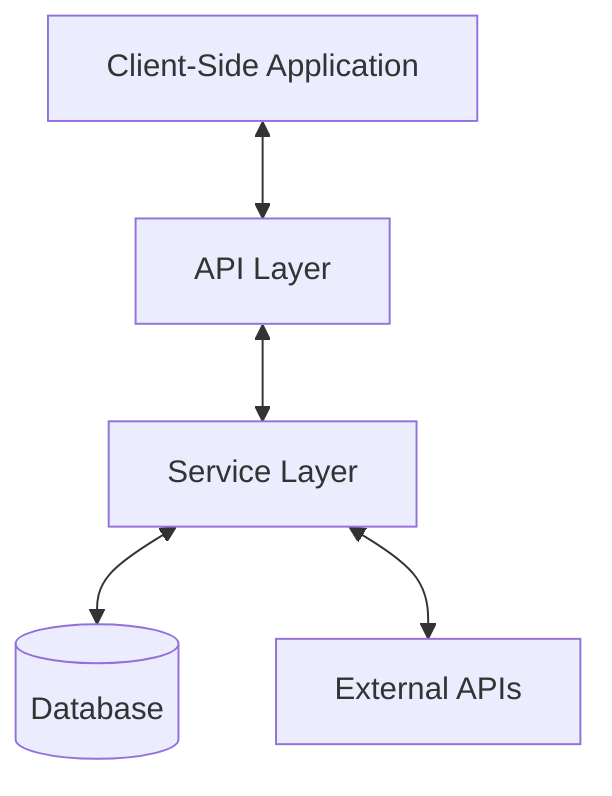
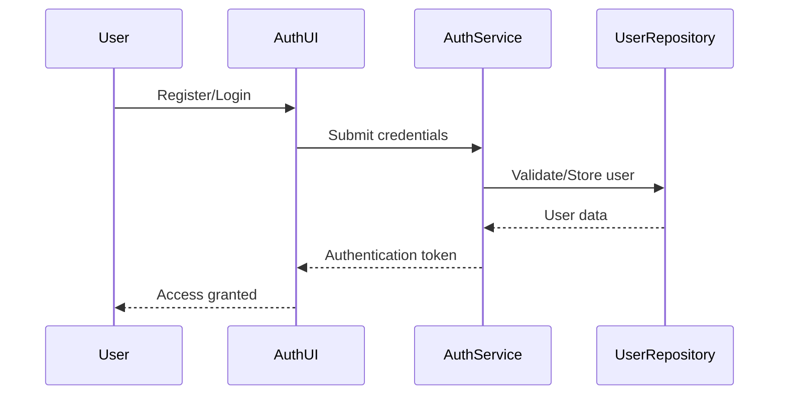
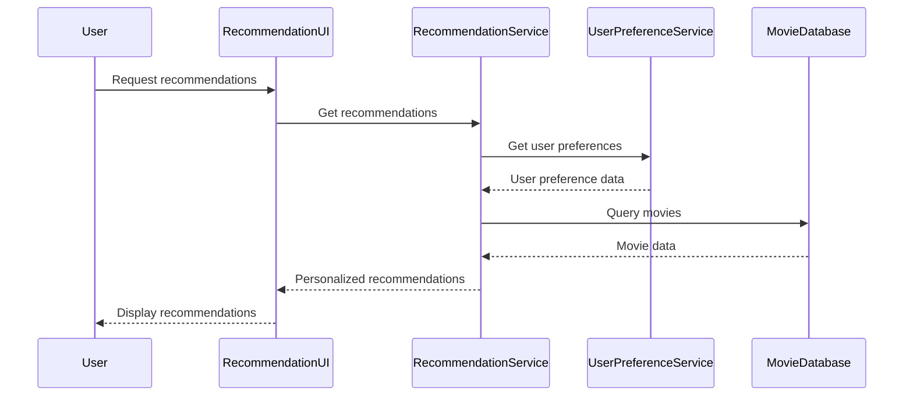

# System Patterns: Movie Recommender

## Architecture Overview
The Movie Recommender follows a modern web application architecture with clear separation of concerns:

## Key Components

### Frontend
- **Component-Based UI**: Using a component library for consistent UI elements
- **State Management**: Centralized state management for user preferences and application data
- **Responsive Design**: Fluid layouts that adapt to different screen sizes
- **Client-Side Routing**: For seamless navigation without page reloads

### Backend
- **RESTful API**: Standardized endpoints for data retrieval and manipulation
- **Authentication Service**: Handles user registration, login, and session management
- **Recommendation Engine**: Core algorithm for generating personalized movie suggestions
- **Data Integration Layer**: Manages connections to external movie databases and APIs

### Database
- **User Data Store**: Stores user profiles, preferences, and interaction history
- **Movie Catalog**: Comprehensive database of movies with detailed metadata
- **Caching Layer**: Improves performance for frequently accessed data

## Design Patterns

### Frontend Patterns
- **Container/Presentational Pattern**: Separates data handling from UI rendering
- **Higher-Order Components**: For reusable functionality across components
- **Render Props**: For component composition and logic sharing
- **Custom Hooks**: For reusable stateful logic

### Backend Patterns
- **Repository Pattern**: Abstracts data access logic
- **Service Layer**: Encapsulates business logic
- **Dependency Injection**: For loose coupling between components
- **Middleware Pattern**: For request processing, authentication, and logging

### Data Patterns
- **Data Transfer Objects (DTOs)**: For structured data exchange between layers
- **Entity-Relationship Model**: For database schema design
- **Caching Strategy**: For optimizing frequently accessed data

## Component Relationships

### User Management Flow

### Recommendation Flow

## Technical Decisions

### Frontend Framework Selection
The application uses a modern JavaScript framework/library for building interactive UIs with component-based architecture, efficient rendering, and robust state management.

### API Design
RESTful API design with JSON as the data exchange format, following standard HTTP methods and status codes for predictable behavior.

### Authentication Strategy
Token-based authentication using JWT (JSON Web Tokens) for stateless authentication and authorization.

### Database Selection
A combination of relational database for structured data (user profiles, movie metadata) and potentially NoSQL for handling recommendation algorithms and flexible data structures.

This document outlines the architectural patterns and design decisions that guide the development of the Movie Recommender application. It serves as a reference for maintaining consistency in implementation and for onboarding new developers to the project.
